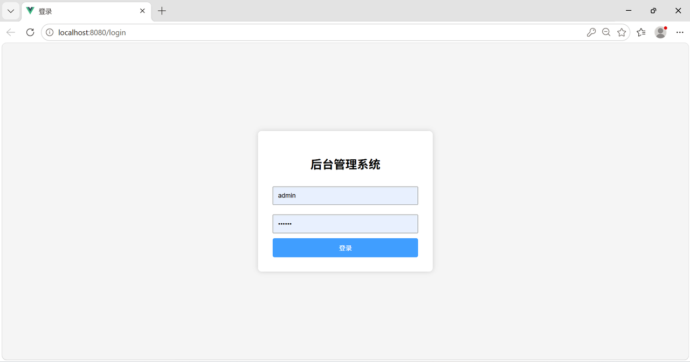

# Admin\_demo REAMME\.md

### SpringBoot 后台管理系统

#### 一、项目简介

基于 RBAC（基于角色的访问控制）模型的通用后台管理系统。采用 Spring Boot  \+ MyBatis\-Plus  \+ Spring Security  \+ Thymeleaf 技术栈，实现用户、角色、权限三大模块的增删改查与多对多关联分配，支持分页查询、批量分配、表单登录鉴权，前端通过单页面动态切换实现全部管理功能。

#### 二、核心功能

- **用户管理**：用户的新增、修改、删除、分页查询，支持用户名唯一约束

- **角色管理**：角色的新增、修改、删除、分页查询，支持角色编码唯一约束

- **权限管理**：权限/菜单的新增、修改、删除、分页查询，支持目录、菜单、按钮三种类型

- **用户分配角色**：为单个用户批量分配多个角色（复选框多选，先删后插）

- **角色分配权限**：为单个角色批量分配多个权限（复选框多选，先删后插）

- **登录鉴权**：基于 Spring Security 的表单登录，登录成功跳转首页，支持退出登录

- **统一返回与异常处理**：全局 Result 封装，全局异常捕获，权限不足返回 403

#### 三、环境要求

|工具|版本要求|
|---|---|
|JDK|18\.0\.2\+|
|Maven|3\.8\.x\+|
|MySQL|8\.x|
|IntelliJ IDEA|2024\.1\.1\+|

#### 四、技术栈

|技术|版本|说明|
|---|---|---|
|Spring Boot|3\.1\.5|项目主体框架，自动配置|
|Spring Security|6\.1\.5|登录认证与接口权限控制|
|MyBatis\-Plus|3\.5\.3\.1|ORM 映射、分页插件、通用 CRUD|
|Thymeleaf|3\.1\.2|前端页面模板引擎|
|MySQL Connector/J|8\.0\.33|MySQL 数据库驱动|
|JWT \(jjwt\)|0\.11\.5|Token 生成、解析与校验|
|Lombok|1\.18\.30|实体类 getter/setter 自动生成|
|HikariCP|5\.0\.1|数据库连接池|

#### 五、安装 / 部署步骤

##### 1\. 创建数据库

```SQL
CREATE DATABASE admin_demo DEFAULT CHARACTER SET utf8mb4;
USE admin_demo;
```

##### 2\. 执行建表 SQL

依次创建 RBAC 五张表：

|表名|说明|关键字段|
|---|---|---|
|`sys_user`|用户表|id, username, password, nickname, email, phone, status|
|`sys_role`|角色表|id, role\_name, role\_code, description|
|`sys_permission`|权限/菜单表|id, parent\_id, name, path, component, perms, type, icon, sort|
|`sys_user_role`|用户\-角色关联表|id, user\_id, role\_id|
|`sys_role_permission`|角色\-权限关联表|id, role\_id, permission\_id|

所有表的 `id` 字段必须设置为 `AUTO_INCREMENT` 主键。建表后初始化管理员账号：

```SQL
INSERT INTO sys_user (username, password, nickname, status)
VALUES ('admin', '123456', '超级管理员', 1);

INSERT INTO sys_role (role_name, role_code, description)
VALUES ('超级管理员', 'ADMIN', '拥有所有权限');

INSERT INTO sys_user_role (user_id, role_id) VALUES (1, 1);
```

##### 3\. 修改数据库配置

编辑 `src/main/resources/application.yml`，将用户名和密码改为本地数据库配置：

```YAML
server:
  port: 8080

spring:
  datasource:
    driver-class-name: com.mysql.cj.jdbc.Driver
    url: jdbc:mysql://localhost:3306/admin_demo?useUnicode=true&characterEncoding=utf8&serverTimezone=GMT%2B8&useSSL=false
    username: root   # 改为你的数据库用户名
    password: root   # 改为你的数据库密码
  thymeleaf:
    cache: false

mybatis-plus:
  configuration:
    map-underscore-to-camel-case: true
  mapper-locations: classpath:mapper/*.xml

jwt:
  secret: adminDemoSecretKey2024   # 建议改为更长的随机字符串
  expiration: 86400000             # Token 有效期：1天（毫秒）
```

##### 4\. 安装依赖

在项目根目录执行：

```Bash
mvn clean install
```

#### 六、项目目录结构

```Plain Text
src/main/java/com/example/admin_demo1
├── admin_demo1Application.java     # SpringBoot 启动类
├── common/                          # 通用类
│   ├── Result.java                  # 统一返回结果（code/msg/data）
│   └── GlobalExceptionHandler.java  # 全局异常处理
├── config/                          # 配置类
│   ├── SecurityConfig.java          # Spring Security 安全配置
│   └── MyBatisPlusConfig.java       # MyBatis-Plus 分页插件配置
├── controller/                      # 控制层
│   ├── LoginController.java         # 页面路由（登录页、首页、各管理页）
│   ├── SysUserController.java       # 用户管理接口（含分配角色）
│   ├── SysRoleController.java       # 角色管理接口（含分配权限）
│   └── SysPermissionController.java # 权限管理接口
├── entity/                          # 实体类
│   ├── SysUser.java                 # 用户实体
│   ├── SysRole.java                 # 角色实体
│   ├── SysPermission.java           # 权限实体
│   ├── SysUserRole.java             # 用户-角色关联实体
│   └── SysRolePermission.java       # 角色-权限关联实体
├── mapper/                          # Mapper 接口（继承 BaseMapper）
├── service/                         # 业务层接口（继承 IService）
│   └── impl/                        # 业务层实现（继承 ServiceImpl）
└── utils/                           # 工具类
    └── JwtUtil.java                 # JWT 生成、解析、校验工具

src/main/resources
├── application.yml                  # 应用配置（端口、数据源、JWT）
└── templates/                       # Thymeleaf 前端页面
    ├── login.html                   # 登录页
    ├── index.html                   # 管理首页（单页面含全部功能）
    ├── user.html                    # 用户管理独立页
    ├── role.html                    # 角色管理独立页
    ├── permission.html              # 权限管理独立页
    ├── user_role.html               # 用户分配角色独立页
    └── role_perm.html               # 角色分配权限独立页
```

#### 七、使用 / 启动说明

##### （一）启动方式：

1. IDEA 启动

    1. 用 IntelliJ IDEA 打开项目

    2. 找到启动类 `src/main/java/com/example/admin_demo1/admin_demo1Application.java`

    3. 右键 → Run 'admin\_demo1Application'

    4. 控制台输出 `Started admin_demo1Application` 即启动成功

2. 命令行启动

```Bash
mvn spring-boot:run
```

3. 打包后启动

```Bash
mvn clean package
java -jar target/admin_demo-0.0.1-SNAPSHOT.jar
```

##### （二）访问系统

- 服务端口：`8080`

- 登录页：`http://localhost:8080/login`

- 默认管理员账号：`admin` / `123456`

- 登录成功后自动跳转：`http://localhost:8080/index`

- 首页包含：用户管理、角色管理、权限管理、用户分配角色、角色分配权限、退出登录




#### 八、停止 / 关闭方法

##### 1、IDEA 中停止

点击 IDEA 控制台左侧的**红色停止按钮**（Stop 'admin\_demo1Application'）。

##### 2、Windows 命令行停止

- 如果是 `mvn spring-boot:run` 或 `java -jar` 启动：在控制台按 `Ctrl + C`

- 如果进程卡住，通过端口查找并结束：

```Bash
# 查找占用 8080 端口的进程 PID
netstat -ano | findstr :8080

# 根据 PID 强制结束进程
taskkill /F /PID <进程号>
```

##### 3、Linux / Mac 停止

```Bash
# 查找项目进程
ps -ef | grep admin_demo1

# 结束进程
kill -9 <进程号>
```


